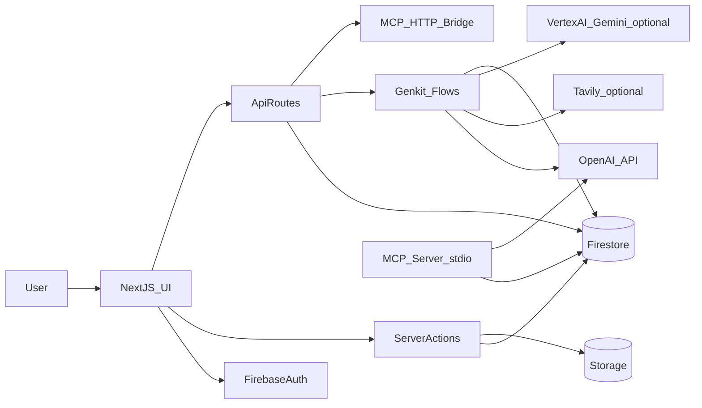

# Architecture (C4-ish) — Pandora’s Box

## Purpose
Explain the major components, boundaries, and data flows **as implemented in this repo**, including where memory lives, how retrieval works, and how MCP fits.

## Executive summary
Pandora’s Box is a Next.js App Router application that provides:
- A chat UI with **Threads** and **Messages** persisted to Firestore
- A long-term memory system using **embeddings stored in Firestore** and retrieved via Firestore native vector search (`findNearest`)
- Orchestration via “lanes” (Genkit flows): Chat lane orchestrates Memory lane (fire-and-forget) and Answer lane (response generation)
- Optional hybrid retrieval combining internal memories with external web results (Tavily) and adaptive weights
- Integrations via MCP tools and ChatGPT Actions-style endpoints
- Scheduled background work via API routes acting as cron endpoints

## Component diagram (high level)
Mermaid source: `docs/diagrams/architecture_component.mmd`



## Data flow diagram
Mermaid source: `docs/diagrams/architecture_dataflow.mmd`

```mermaid
flowchart TD
  ui[UI] -->|submit| chatAction[submitUserMessage]
  chatAction --> history[(history)]
  chatAction --> threads[(threads)]
  chatAction --> chatLane[runChatLane]

  chatLane --> memLane[runMemoryLane]
  chatLane --> ansLane[runAnswerLane]

  memLane --> openaiEmb[OpenAI_Embeddings]
  openaiEmb --> history
  memLane --> memories[(memories)]
  memLane --> context[(users_state_context)]
  memLane --> graph[(system_knowledge_graph)]
  memLane --> edges[(knowledge_edges)]

  ansLane --> vec[findNearest_VectorSearch]
  vec --> memories
  vec --> history
  ansLane --> openaiChat[OpenAI_Chat]
  ansLane --> artifacts[(artifacts)]
  ansLane --> history

  cron[CronRoutes] --> memories
  cron --> context
  cron --> external[(external_knowledge)]
```

## Phase map (discovered)
Mermaid source: `docs/diagrams/architecture_phase_map.mmd` (autogenerated by `npm run docs:status`).

## Core flows (“lanes”)
### Chat lane (orchestrator)
- **Entrypoint**: `runChatLane` in `src/ai/flows/run-chat-lane.ts`
- **Triggered by**: `submitUserMessage` server action in `src/app/actions/chat.ts` (via `after()` non-blocking callback)
- **Responsibilities**:
  - Create a placeholder assistant message in Firestore `history` with `status: processing`
  - Kick off Memory lane asynchronously (fire-and-forget)
  - Run Answer lane and persist final assistant response + embedding
  - Generate follow-up suggestions and persist into `users/{userId}/state/suggestions`
  - Optionally enqueue deep research topics to `learning_queue` when a response is low-confidence
  - Trigger thread summarization (`summarizeThread`)

### Memory lane (persistence + extraction)
- **Entrypoint**: `runMemoryLane` in `src/ai/flows/run-memory-lane.ts`
- **Responsibilities**:
  - Semantic “bouncer” gating (skip low-value short messages)
  - Generate embeddings for user message and update `history/{messageId}.embedding`
  - Extract updated `context` note and `search_queries` (memories) and persist them
  - Persist search queries into `memories` via `saveMemoriesBatch` (`src/lib/memory-utils.ts`)
  - Update knowledge graph from extracted text (via `src/lib/knowledge-graph.ts`)
  - For audio messages, optionally persist transcript and embed transcript

### Answer lane (retrieval + response)
- **Entrypoint**: `runAnswerLane` in `src/ai/flows/run-answer-lane.ts`
- **Responsibilities**:
  - Fetch short-term memory: last ~6 messages in current thread (`history` filtered by `threadId`)
  - Fetch long-term memory: semantic search across `history` and `memories` using `searchHistory` and `searchMemories` (`src/lib/vector.ts`)
  - Rerank memories for OpenAI models; keep larger recall set for Gemini models
  - Build final system prompt including “LONG TERM MEMORY” and “SHORT TERM MEMORY”
  - Generate response using either VertexAI Gemini (via Genkit) or OpenAI
  - Extract `<artifact>` blocks and persist to `artifacts`
  - Generate embedding for assistant response and update assistant message document

## Where memory lives (storage boundaries)
### Firestore collections (root-level)
Enforced by `firestore.rules` and indexed by `firestore.indexes.json`.

Primary collections used by the system include (see `docs/02_DATA_MODEL.md` for entity details):
- `threads`
- `history`
- `memories`
- `artifacts`
- `settings`
- `context_store`
- `system_knowledge_graph`, `knowledge_edges`
- `external_knowledge`
- `feedback`, `performance_metrics`, `meta_learning_state`
- `system_phases`, `system_logs`, `system_governance`, `system_federation`, `system_selfheal`
- `learning_queue`

### Vector retrieval
- **Implementation**: Firestore native vector search via `.findNearest('embedding', queryEmbedding, ...)` in `src/lib/vector.ts`.
- **Index**: vector indexes in `firestore.indexes.json` for collection groups like `history` and `memories`.

## Knowledge graph
- **Extraction**: `src/lib/knowledge-graph.ts` (`extractConcepts`, `updateKnowledgeGraphFromMemory`) is invoked from `src/lib/memory-utils.ts` and from lanes.
- **Read API**: `src/app/api/system/knowledge/route.ts` and UI `src/app/(pandora-ui)/graph/page.tsx`.

## Cron/agents model
This repo uses Next.js API routes as cron endpoints (Cloud Scheduler expected):
- `/api/cron/cleanup` (`src/app/api/cron/cleanup/route.ts`)
- `/api/cron/daily-briefing` (`src/app/api/cron/daily-briefing/route.ts`)
- `/api/cron/context-decay` (`src/app/api/cron/context-decay/route.ts`)
- `/api/cron/nightly-reflection` (`src/app/api/cron/nightly-reflection/route.ts`)
- `/api/cron/deep-research` (`src/app/api/cron/deep-research/route.ts`)
- `/api/cron/reindex-memories` (`src/app/api/cron/reindex-memories/route.ts`)
- `/api/cron/meta-learning` (`src/app/api/cron/meta-learning/route.ts`)

## MCP integration
There are two integrations:
- **Stdio MCP server**: `src/mcp/index.ts` (tools: `search_knowledge_base`, `add_memory`, `generate_artifact`)
- **HTTP bridge**: `src/app/api/mcp/[...tool]/route.ts` (ChatGPT Actions compatible)

## Where in code (primary)
- **Server actions**: `src/app/actions/chat.ts`, `src/app/actions/knowledge.ts`, `src/app/actions/user.ts`, `src/app/actions/brain-actions.ts`
- **API routes**: `src/app/api/**/route.ts`
- **Lanes**: `src/ai/flows/run-chat-lane.ts`, `src/ai/flows/run-memory-lane.ts`, `src/ai/flows/run-answer-lane.ts`, `src/ai/flows/run-hybrid-lane.ts`, `src/ai/flows/run-self-improvement.ts`
- **Agents**: `src/ai/agents/nightly-reflection.ts`, `src/ai/agents/deep-research.ts`
- **Vector + memory utils**: `src/lib/vector.ts`, `src/lib/memory-utils.ts`
- **Knowledge graph**: `src/lib/knowledge-graph.ts`, `src/lib/graph-analytics.ts`, `src/lib/temporal-analysis.ts`
- **Hybrid**: `src/lib/hybrid-search.ts`, `src/lib/external-cache.ts`, `src/lib/tavily.ts`
- **Security rules**: `firestore.rules`, `storage.rules`
- **Indexes**: `firestore.indexes.json`
- **Hosting**: `firebase.json`, `apphosting.yaml`


