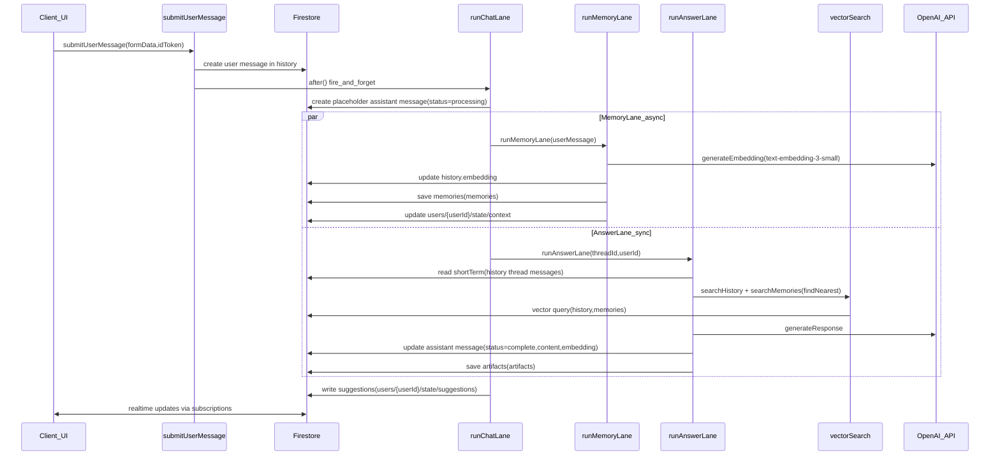
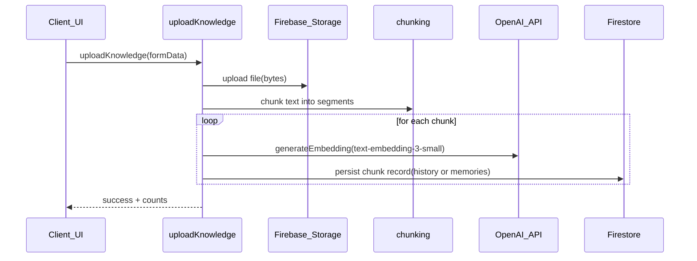
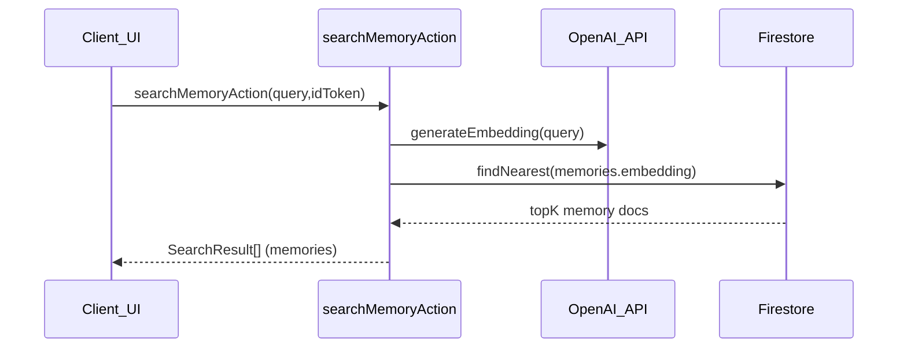
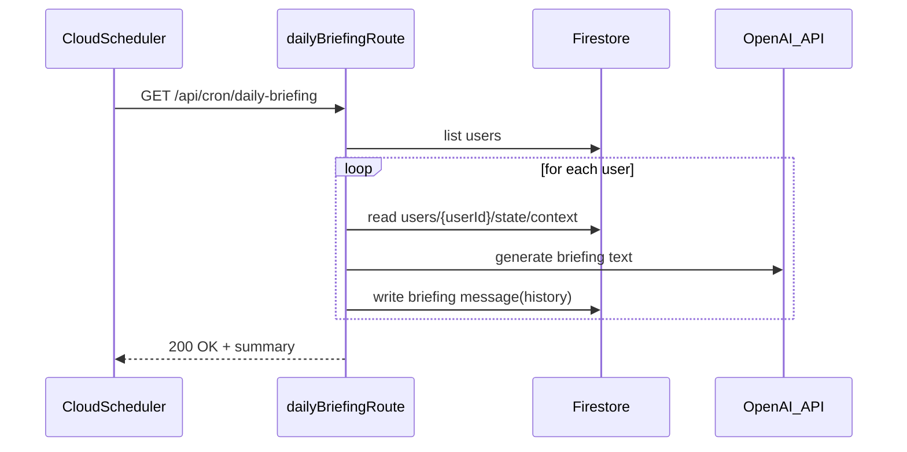

# Backend System — Actions, APIs, Lanes, Agents

## Purpose
Describe the backend implementation: orchestrators/lanes/agents, embedding pipeline, cron jobs, ingestion, rate limiting, and background tasks.

## Execution surfaces
### Server actions (internal API)
Located in `src/app/actions/*`, exported via `src/app/actions.ts`:
- Chat: `src/app/actions/chat.ts`
- Knowledge: `src/app/actions/knowledge.ts`
- User: `src/app/actions/user.ts`
- Brain controls: `src/app/actions/brain-actions.ts`

### HTTP API routes (external integrations + cron)
Located under `src/app/api/**/route.ts`. See `docs/03_API_REFERENCE.md` for full inventory.

## Lanes (Genkit flows)
### Chat lane (`runChatLane`)
- **File**: `src/ai/flows/run-chat-lane.ts`
- **Triggered by**: `submitUserMessage` in `src/app/actions/chat.ts` via `after(async () => ...)`.
- **Writes**:
  - placeholder assistant message in `history` (status `processing`, progress log)
  - suggestions in `users/{userId}/state/suggestions`
  - `learning_queue` item when `lowConfidenceTopic` exists (feature-flagged by `ENABLE_DEEP_RESEARCH`)

### Memory lane (`runMemoryLane`)
- **File**: `src/ai/flows/run-memory-lane.ts`
- **Key behaviors**:
  - “Bouncer” gating: skip low-value short messages (and uses Gemini Flash for cheap classification)
  - async embedding generation for user message and update into `history/{messageId}.embedding`
  - context note persistence to `users/{userId}/state/context`
  - memory extraction into `memories` via `saveMemoriesBatch` (`src/lib/memory-utils.ts`)
  - knowledge graph updates

### Answer lane (`runAnswerLane`)
- **File**: `src/ai/flows/run-answer-lane.ts`
- **Key behaviors**:
  - short-term memory: last ~6 messages in `history` for thread
  - long-term memory: vector search across `history` and `memories` (`src/lib/vector.ts`)
  - reranking for OpenAI (uses `gpt-4o-mini` for ranking) and larger context for Gemini
  - response generation (OpenAI or VertexAI Gemini via Genkit)
  - artifact extraction and persistence to `artifacts`
  - assistant response embedding and final `history/{assistantMessageId}` update to status `complete`

### Phase 5 hybrid lane (`runHybridLane`)
- **File**: `src/ai/flows/run-hybrid-lane.ts`
- **Uses**:
  - `hybridSearch` (`src/lib/hybrid-search.ts`): internal semantic + external Tavily with caching and adaptive weights
  - Returns `fusedResults` and `fusedContext`

### Phase 6 self-improvement (`runSelfImprovement`)
- **File**: `src/ai/flows/run-self-improvement.ts`
- **Uses**: `src/lib/meta-learning.ts`, `src/lib/feedback-manager.ts`, `src/lib/performance-tracker.ts`
- **Cron route**: `src/app/api/cron/meta-learning/route.ts`

## Agents
### Nightly reflection
- **Agent flow**: `src/ai/agents/nightly-reflection.ts`
- **Cron route**: `src/app/api/cron/nightly-reflection/route.ts`
- **Writes**: insight memories (`type: insight`) and question memories (`type: question_to_ask`) via `src/lib/memory-utils.ts`

### Deep research
- **Agent**: `src/ai/agents/deep-research.ts`
- **Cron route**: `src/app/api/cron/deep-research/route.ts`
- **Flow**:
  - reads `learning_queue` pending items
  - searches web via Tavily (`src/lib/tavily.ts`)
  - synthesizes knowledge via OpenAI
  - stores acquired knowledge into `memories` via `saveMemory`

## Embedding pipeline
### Embeddings generation
- **Implementation**: `generateEmbedding` and `generateEmbeddingsBatch` in `src/lib/vector.ts`
- **Model**: OpenAI `text-embedding-3-small` (dimension 1536) (repo-derived from `src/lib/vector.ts`)

### Vector search
- **Implementation**: `searchHistory` and `searchMemories` in `src/lib/vector.ts` using Firestore `.findNearest()`.
- **Index**: vector indexes configured in `firestore.indexes.json`.

## Rate limits
- **Implementation**: token bucket / sliding window stored in Firestore `rateLimits` (`src/lib/rate-limit.ts`)
- **Enforced in**:
  - chat message send: `submitUserMessage` (`src/app/actions/chat.ts`)
  - knowledge upload: `uploadKnowledge` (`src/app/actions/knowledge.ts`)

## Cron endpoints (ops lane)
- `/api/cron/cleanup`: retention cleanup of old threads/memories/history
- `/api/cron/daily-briefing`: generate a daily briefing per user using OpenAI
- `/api/cron/context-decay`: decay importance values
- `/api/cron/reindex-memories`: repair missing/invalid embeddings in `memories`

## Where in code
- Actions: `src/app/actions/*`
- APIs: `src/app/api/**/route.ts`
- Lanes: `src/ai/flows/*`
- Agents: `src/ai/agents/*`
- Embeddings/search: `src/lib/vector.ts`
- Memory utils: `src/lib/memory-utils.ts`
- Rate limit: `src/lib/rate-limit.ts`

## Diagrams (Mermaid)
Mermaid sources live in `docs/diagrams/*.mmd` and are embedded here for convenience.

### Send message (client → lanes → persist)
Source: `docs/diagrams/sequence_send_message.mmd`

### Knowledge upload
Source: `docs/diagrams/sequence_knowledge_upload.mmd`

### Memory search
Source: `docs/diagrams/sequence_memory_search.mmd`

### Daily briefing cron
Source: `docs/diagrams/sequence_daily_briefing_cron.mmd`

